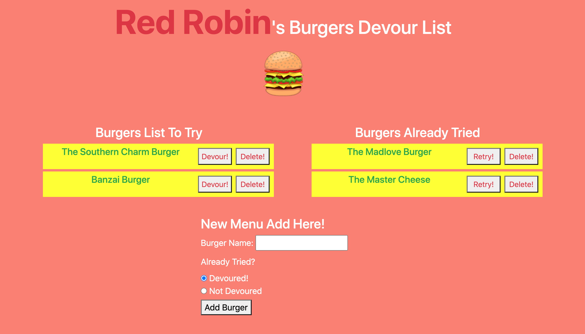

# Homework 12 - Node Express Handlebars - Burger Logger

## Objective
To create a burger logger with MySQL, Node, Express, Handlebars and ORM. Follow the MVC design pattern; use Node and MySQL to query and route data in your app, and Handlebars to generate your HTML.

## Acceptance Criteria
- Whenever a user submits a burger's name, your app will display the burger on the left side of the page -- waiting to be devoured.
- Each burger in the waiting area also has a `Devour it!` button. When the user clicks it, the burger will move to the right side of the page.
- Your app will store every burger in a database, whether devoured or not.
- Follow the MVC design instruction
    * App setup : express, mysql and express-handlebars
    * DB setup : schema.sql and seeds.sql
    * Config setup : connection.js and orm.js
    * Model setup : burger.js
    * Controller setup : burgers_controller.js
    * View setup : handlebars files
- This assignment must be deployed to Heroku
- Add this homework to your portfolio

## Application

### Github Repository URL
https://github.com/thammaraku/burger

### Heroku Deployed Link
https://still-coast-35905.herokuapp.com/

### Application Screenshot

## Knowledge learned from this assignment
1. Using MySQL to architect and manage database
2. Using Handlebars to generate HTML
3. Using Heroku and JawsDB to deploy application
4. Following MVC (Model View Controller) design pattern
5. Using ORM to create the methods in order to retrieve and store data
6. Hiding credential by using dotenv